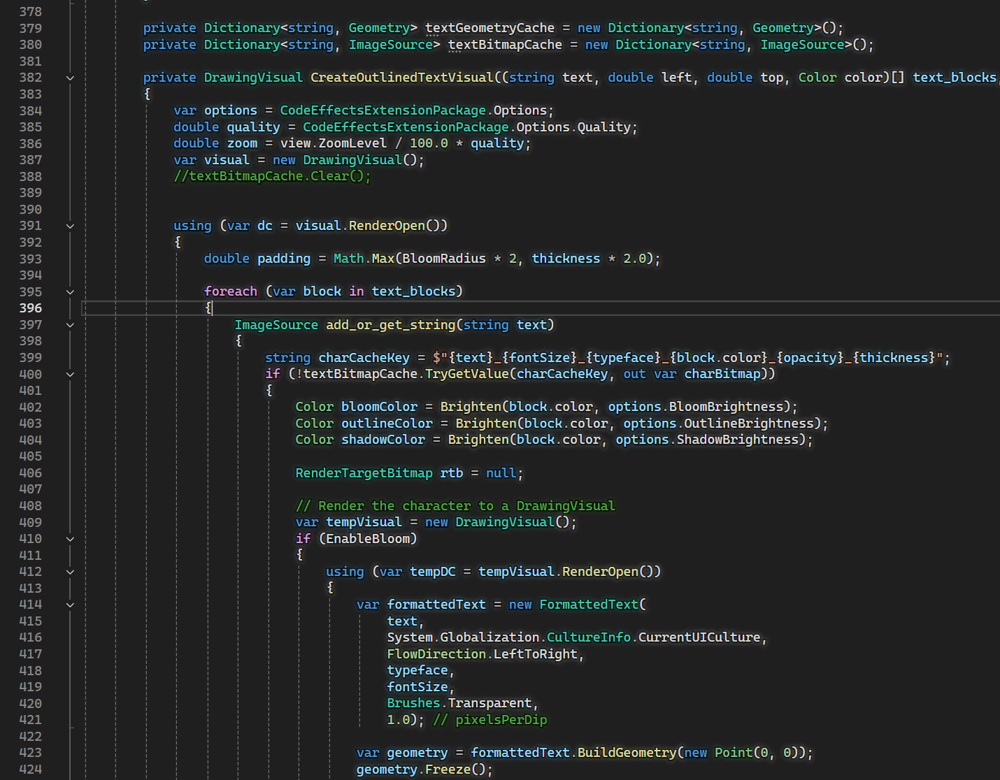
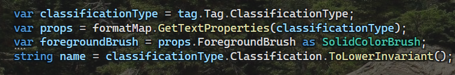

# Visual Studio Code Effects
An extension for Visual Studio 2022 that adds various text effects (drop shadow, outline, bloom) to code.

## Features
- Drop shadow with a configurable angle, distance, color, and blurring radius
- Outline with a configurable width, color, and blurring radius
- Bloom with a configurable blurring radius and color
- Render caching to keep documents responsive

## Settings
Settings can be figured by going to `Tools > Options > Text Editor > (Other Settings) > Effects`

### Colors
Colors are currently limited to being simple multipliers of the syntax-highlighted code being decorated. If you want black outlines, you can set mulitpliers to 0, or a very high value for white.

### Quality
The rendering can appear pixelated at very high font sizes. This can be improved by changing the quality value from 1 to something else like 2.

## Uses
This was made to work alongside [ClaudiaIDE](https://github.com/buchizo/ClaudiaIDE), an extension that displays a background image in the code editor. These effects can help with readability.

Note that bloom can be used to darken the area around text while still keeping a sharp outline by setting the bloom color to a low value like 0.1.

## Performance
Certain features like bloom can be very performance heavy, and you may notice lag while quickly scrolling through documents. However, this delay should only occur the first time a line is seen.
Slow WPF drawing is mitigated in two ways:

### Span-level image caching
Spans are first rendered to an image and then drawn. A span is just a specific region of text. These get used when new lines are loaded into view.

### Character-level image caching
When a line is being modified, it switches from span-level caching to character-level caching, which use the same concept but on a character level.

# Issues and TODO
This is my first Visual Studio extension, so there are likely issues that may or may not get ironed out over time.
- Sometimes specific keywords or strings don't seem to be decorated depending on the level of zoom and code window size.
- The effects don't cover the entire area for extremely large fonts/zoom levels.
- This has really only been tested on C# and loosely on C++ and on a single font.
- Effects lile bloom could be useful on certain syntax-highlighted types. There's some code that sort of exists for it, but it's not being used yet.
- DPI scaling probably doesn't work properly.
- Outlines seem to be like half a unit biased in the left/up direction.
- I'm not really sure how to properly handle tabs. The current method of splitting spans by tabs seems to work okay, but if you ever notice any misplaced effects, it's probably because of tabs.

# Credits
Most of this was... "vibe coded"... in a single afternoon, so thanks to ChatGPT for the help. Any contributions and further testing is welcome.
